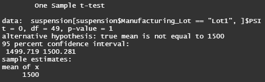
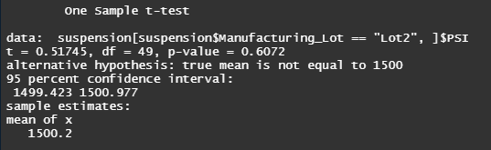
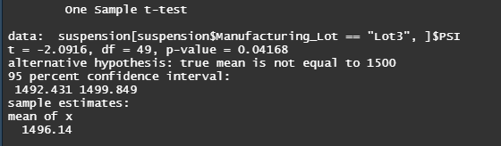

<h1>Mecha-Car Statistical Analysis</h1>

<h2>Linear Regression to Predict MPG</h2>

    Vehicle length, weight, ground clearance are statistically significant while spoiler angle and AWD are not.

    Vehicle length, vehicle weight, ground clearance provide a non-random amount of variance to the mpg values in the dataset.
    has significant impact

    The slope of the linear model is not considered to be zero because there is a significant relationship between vehicle lenght, vehicle weight, ground clearance and mpg.

    This model preicts mpg of MechaCar prototypes relatively because we have a R squared value of ~0.72.

</img>  

<h2>Summary statistics on Suspension Coils</h2>

    
    When the data from all of the lots are combined, it is to par with our manufacturing standards with a variance = 62.3. This is well below our cutoff of 100 PSI.
    
    However, when the suspension data grouped by manufacturing lots, only lots one and two meet design specifications. Lot three's variance is 170.3, which exceeds our limit. Thus, Lot three is not up to specifications and requires inspection. (See images below for more details).

</img> 
</img>  

<h2>T-Tests on Suspension Coils</h2>

    When all manufacturing lots were compared to the population mean of 1500 using a t-test, the resulting p-value is 0.06, meaning that we fail to reject the null hypothesis. This means that the difference between the two means are neglible.

    When individual lots are compared to the population mean however, it is a slightly different story. Like before, the difference between the population mean and the sample means of Lot 1 and 2 (with p-values of 1 and 0.61 respectively), the difference between them is negligible. 

    Lot three has a p-value of 0.042, meaning we accept the alternate hypothesis there is a significant difference from the population mean. (See images below for more details).

</img> 
</img> 
</img> 
</img>  

<h2>Study Design: MechaCar vs Competition</h2>

    Here we propose an additional study to compare MechaCar to its competitors. 

    We can gather data for highway fuel efficiency for MechaCar's vehicles and vehicles from another manufacturer and then perform statistical tests to compare the differences between them.

    We can achieve this by performing a two-sample t-test.

    Our null hypothesis will be that there is no difference between highway fuel efficiency for MechaCar's vehicles and another manufacturer's vehicles.

    To perform this test, we will need data such as: vehicle style, size, weight, horsepower, maintenance cost, highway fuel efficiency, type of engine, etc. 

    If we discover a significant difference between the two groups, then we can test things further by filtering the data by manufacturer and running t-tests to see which variables significantly contribute to highway fuel efficiency.

